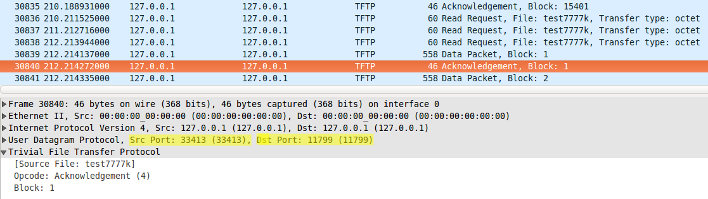

## Requirements: 
Lib aenum:  

- https://pypi.python.org/pypi/aenum
- [http://stackoverflow.com/questions/36932/how-can-i-represent-an-enum-in-python](http://stackoverflow.com/questions/36932/how-can-i-represent-an-enum-in-python)

Peut s'installer avec la commande suivante: 

```bash
pip install aenum
```


## Utilisation

Le client se lance de la manière suivante: 

```bash
python src/client.py -get/-put host port filename
```

Le serveur se lance de la manière suivante: 

```bash
python src/server.py -p port -d repertoireAUtiliser  
```

### Sortie

Exemple de sortie en lançant le serveur d'abord, puis en effectuant deux requêtes client d'affilée. 

Serveur:

```bash
$ sudo python src/server.py -p 69 -d serverFiles/
Nb packets lost: 1. Efficienty: 0.999935
Nb packets lost: 0. Efficienty: 1.000000
```

Client:

```bash
$ python src/client.py -put localhost 69 test7777k
Nb packets lost: 0. Efficienty: 1.000000
$ python src/client.py -get localhost 69 test7777k
Nb packets lost: 1. Efficienty: 0.999935
```


## Test du client / serveur

### Déroulement du test

Afin de tester les programmes, un sript __test.sh__ est lancé avec la commande: 

```bash
sudo bash test.sh
```

Il peut être lancé sans les droits admin si l'on indique un autre numéro de port que 69 dans le script. 

Le script effectue la chose suivante: 

1. Téléchargement du fichier test7777k auprès de hepia.infolibre.ch avec client.py. 

   Début du téléchargement

   

   _Le téléchargement d'un grand fichier permet de vérifier la gestion des éventuelles pertes de packets._

   

   Fin du téléchargement

   

2. Vérification checksum du fichier downloadé. Il doit correspondre à  a60814a887e267e2412c268c549be5c0

3. Lancement du serveur local

4. Upload du fichier 7777k vers le serveur local. 

   

   

5. Suppression du fichier 7777k récupéré auprès de hepia.infolibre  _(pour être sûr de faire ensuite le checksum du bon fichier)_

6. Téléchargement du fichier 7777k depuis le serveur local

   

   

7. Vérification du checksum du fichier downloadé depuis le serveur local. Il doit à nouveau correspondre à a60814a887e267e2412c268c549be5c0

__Sortie:__ 

```bash
$ sudo ./test.sh
downloading test7777k from hepia.infolibre.ch... This will take 5 minutes
unexpected block num 11161
unexpected block num 11577
Nb packets lost: 3. Efficienty: 0.999805
downloading finished.
md5 sum after downloading from hepia.infolibre.ch:
a60814a887e267e2412c268c549be5c0  test7777k
starting server
server started. PID : 4143
uploading file to local server...
Nb packets lost: 0. Efficienty: 1.000000
removing first downloaded file
downloading file from local server
Nb packets lost: 1. Efficienty: 0.999935
Nb packets lost: 0. Efficienty: 1.000000
Nb packets lost: 1. Efficienty: 0.999935
md5 sum after downloading from hepia.infolibre.ch:
a60814a887e267e2412c268c549be5c0  test7777k
stoping server
removing files
```

### Vérification du changement de port

A travers wireshark surveillant l'interface locale, nous avons également vérifié que notre serveur notre client changent bien de port une fois la connexion initialisée:

#### Connexion avec PUT Request

Le client envoie sur le port 69.


Le serveur répond en ayant changé de port


Le client continue la connexion sur le nouveau port


#### Multiples GET request

Lorsque le serveur met un peu de temps à répondre, on peut confirmer que le client tente une requête avec un nouveau port à chaque tentative:


#### Connexion avec GET request

Enfin, nous vérifions que le changement de port se fasse correctement avec les Get Request. 


